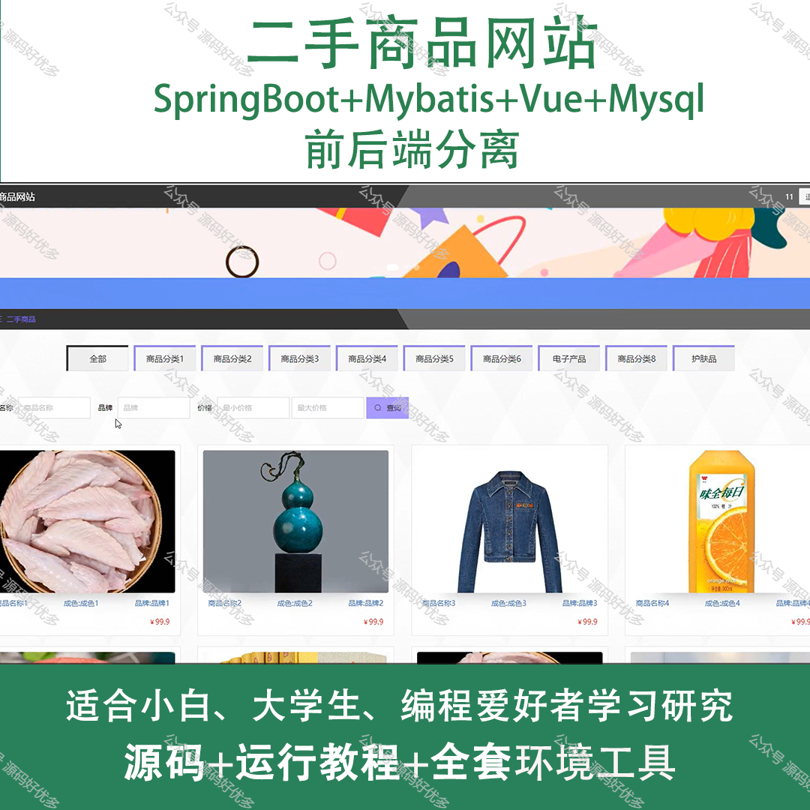
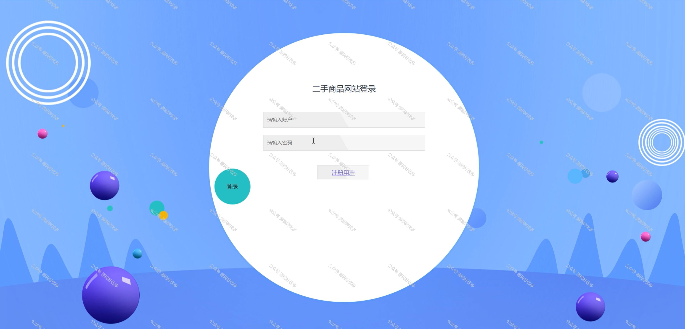
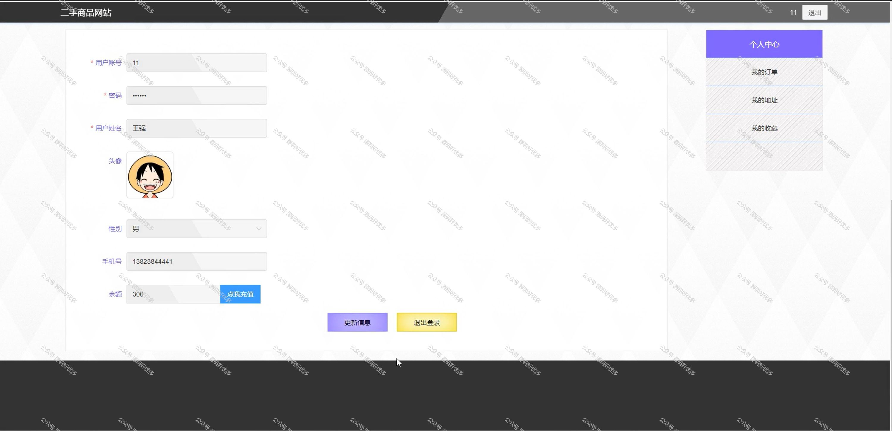
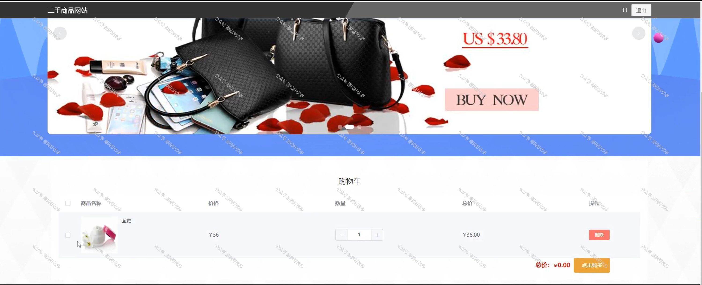
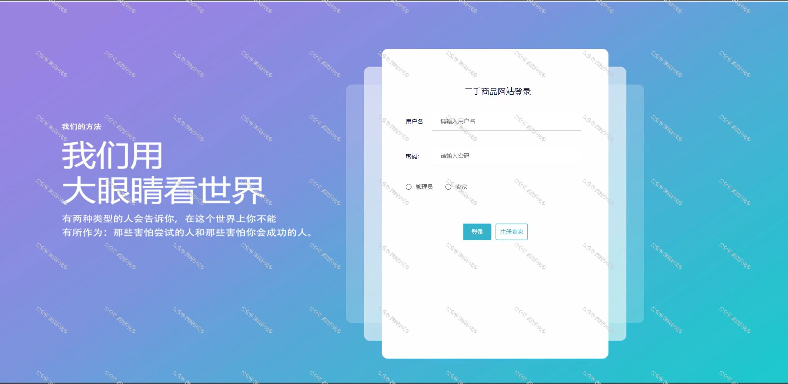
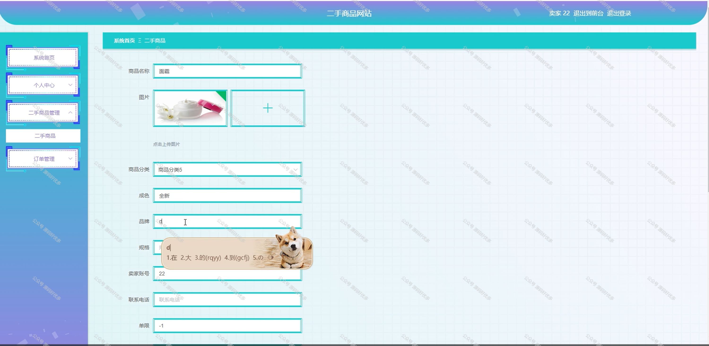
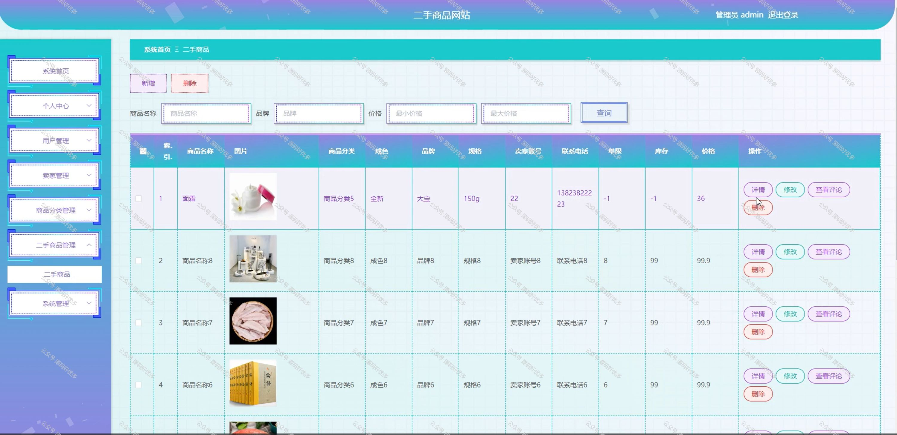
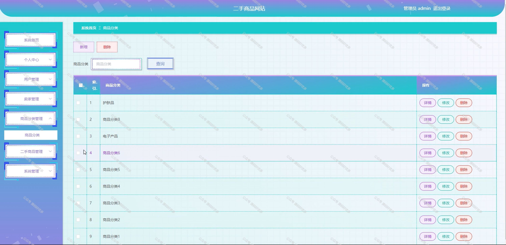
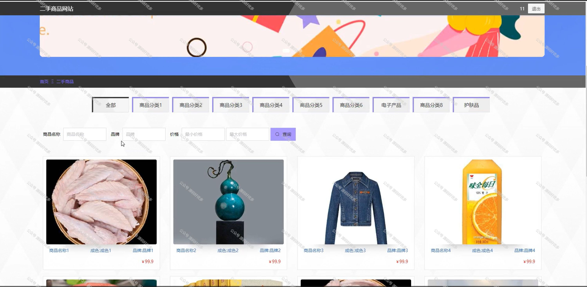
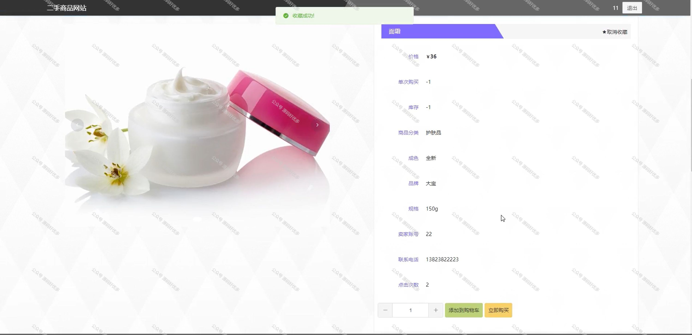

 
## 查看主页获取源码

> **作者介绍**： **✌**全网粉丝10W+本平台特邀作者、博客专家、CSDN新星计划导师、java领域优质创作者,博客之星、掘金/华为云/阿里云/InfoQ等平台优质作者、专注于项目实战 **✌**

  

### 一、作品包含

源码+数据库+全套环境和工具资源+部署教程

### 二、项目技术

前端技术：Html、Css、Js、Vue、Element-ui

数据库：MySQL

后端技术：Java、Spring Boot、MyBatis

  

### 三、运行环境

开发工具：IDEA/eclipse

数据库：MySQL5.7

数据库管理工具：Navicat10以上版本

环境配置软件： JDK1.8+Maven3.6.3

前端Nodejs：14

### 四、项目介绍
项目编号：springbootA148

二手商品网站是在倡导绿色消费和循环经济的大背景下应运而生的一种在线交易平台。它为广大消费者提供了一个便捷、安全的闲置物品买卖空间，不仅能够有效减少资源浪费，促进物品的再利用，还能帮助用户节省开支，实现物品价值最大化。通过这种平台，买卖双方可以轻松发布信息、沟通交流、完成交易，为构建可持续发展的消费模式贡献力量。

前台用户功能：首页、二手商品、公告信息、购物车、个人中心。

后台分为管理员和卖家
管理员的功能：个人中心、用户管理、卖家管理、商品分类管理、二手商品管理、系统管理。
卖家的功能：系统首页、个人中心、二手商品管理、订单管理。

### 五、运行截图

  
